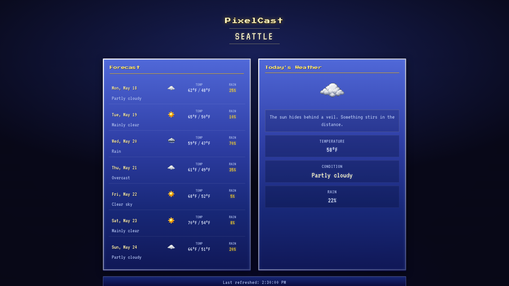
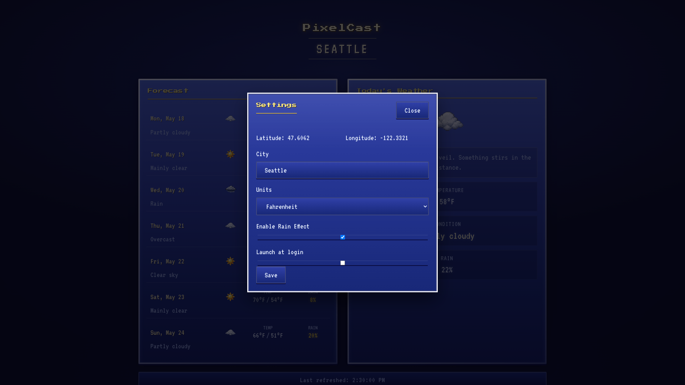
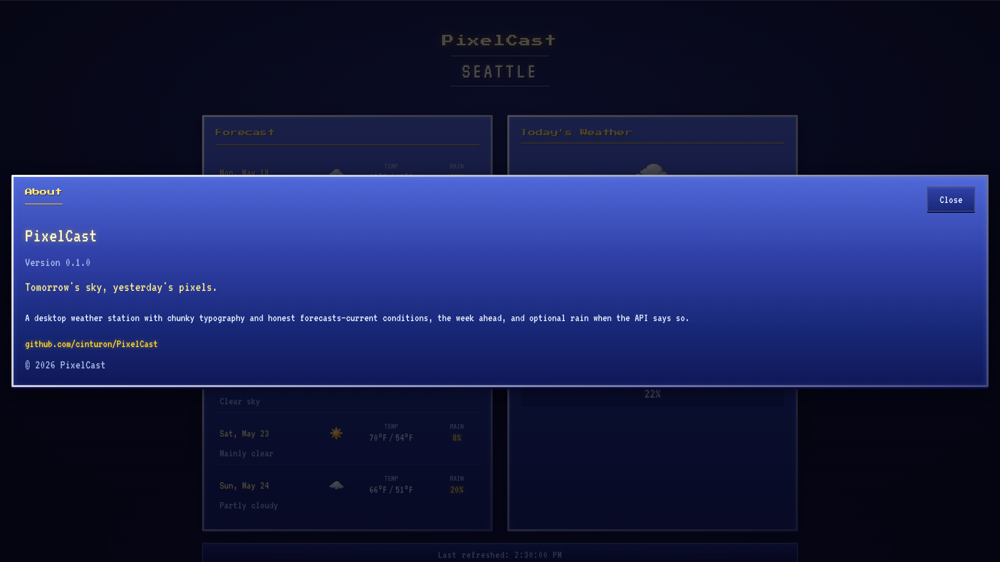

# PixelCast
A Weather app that feels like opening a save file in an old adventure game.

## Screenshots

Full-window captures at 1920×1080.

### Main view
Current conditions and the week-ahead forecast for Seattle.



### Settings
Location, units, rain effect, and launch-at-login preferences.



### About
Version info and project links.



## Requirements

PixelCast is a [Tauri 2](https://v2.tauri.app/) desktop app (React + Rust). Install the tooling for your platform before cloning the repo.

| Tool | Version | Notes |
|------|---------|--------|
| [Bun](https://bun.sh/) | 1.x | Package manager and scripts (`bun install`, `bun run …`) |
| [Rust](https://www.rust-lang.org/tools/install) | stable (2021 edition) | `rustup` recommended; Cargo builds the native shell |
| Tauri prerequisites | — | OS-specific deps (compilers, WebView, etc.): [Tauri prerequisites](https://v2.tauri.app/start/prerequisites/) |

**macOS:** Xcode Command Line Tools (`xcode-select --install`).

**Windows:** Microsoft C++ Build Tools and [WebView2](https://developer.microsoft.com/en-us/microsoft-edge/webview2/).

**Linux:** `webkit2gtk`, `build-essential`, and related packages listed in the Tauri docs for your distro.

An internet connection is required at runtime so PixelCast can fetch weather data.

## Development setup

```bash
git clone https://github.com/cinturon/PixelCast.git
cd PixelCast
bun install
bun run tauri dev
```

The first `tauri dev` run compiles Rust dependencies and may take several minutes. The app window opens when the Vite dev server is ready on port `1420`.

### Useful commands

| Command | Purpose |
|---------|---------|
| `bun run tauri dev` | Run the desktop app with hot reload |
| `bun run build` | Build the frontend only (`dist/`) |
| `bun run test:run` | Run Vitest unit tests |
| `bun run tauri build` | Production build and platform installers (see below) |

## Install from a packaged build

There are no pre-built release downloads yet. Build installers locally, then install from the artifacts Tauri emits.

```bash
git clone https://github.com/cinturon/PixelCast.git
cd PixelCast
bun install
bun run tauri build
```

Artifacts are written under `src-tauri/target/release/bundle/`:

| Platform | Install from |
|----------|----------------|
| **macOS** | `macos/PixelCast.app` or `dmg/PixelCast_0.1.0_aarch64.dmg` (Apple Silicon) |
| **Windows** | `msi/PixelCast_0.1.0_x64_en-US.msi` (or the `.exe` in `nsis/`, depending on your toolchain) |
| **Linux** | `.deb`, `.AppImage`, or `.rpm` under `deb/`, `appimage/`, or `rpm/` |

### macOS

1. Open the `.dmg` and drag **PixelCast** to Applications, or run the `.app` directly from `macos/`.
2. If macOS blocks an unsigned build, right-click the app → **Open**, then confirm.

### Windows

Run the `.msi` installer and follow the prompts, or launch the app from the Start menu after install.

### Linux

Install the `.deb` with your package manager, or make the `.AppImage` executable and run it:

```bash
chmod +x PixelCast_0.1.0_amd64.AppImage
./PixelCast_0.1.0_amd64.AppImage
```

Exact filenames include the version from `package.json` / `tauri.conf.json` and your CPU architecture.

## Project Goals

### Rust goals

- Read and write types — Get comfortable with struct, enum, Option, Result, and serde so JSON from a weather API maps cleanly into Rust types.
- One happy-path command — Implement a single #[tauri::command] like get_forecast(city: String) -> Result<ForecastDto, String> (or a structured error type later). Practice returning errors with ? instead of panicking.
- ? and map_err — Learn to propagate errors from reqwest, parsing, etc., and turn them into something the UI can display.
- Ownership at the boundary — Notice where you need &str vs String; for v1, using String in command args is fine and reduces friction.
- Avoid scope creep in Rust — Defer traits, generics-heavy APIs, and async runtimes beyond what Tauri already gives you until the first command works end-to-end.

### UI goals

- Mock the screen first — Static or fake weather data in React so you can nail layout and the “save file / CRT” feel before Rust does real HTTP.
- One invoke path — Swap mock data for invoke("get_forecast", …) once; handle loading and error in the UI explicitly.
- Desktop polish basics — Resize behavior, readable contrast, keyboard focus on inputs.